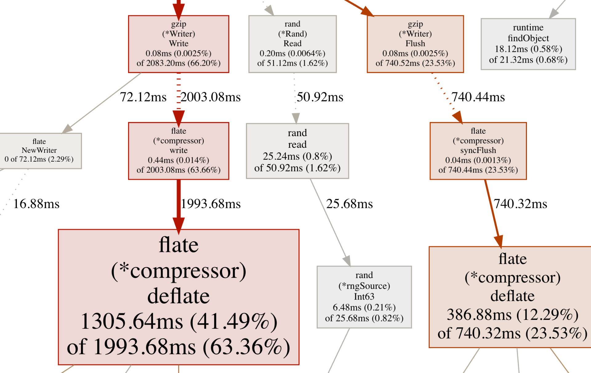

# 读懂pprof生成的报告

众所周知，pprof是Go的一大性能分析杀器，可以采集并分析CPU执行时间、内存分配、阻塞分析以及锁分析。 采集完数据之后以文字和图形的形式展示给使用者。 那么，读懂pprof生成的图形或文字报告就是首当其冲的。这篇文章就来带你读懂pprof报告。

pprof的目标是生成可视化的检测报告。报告是根据采集的样本数据从一个跟节点位置开始按调用关系生成层次化的结构。每个位置包含两个值：

- flat：当前位置自身消耗的值（不包含函数内的调用消耗）
- cum：当前位置及子位置累计的消耗值（即当前函数以及所有调用的函数总消耗）

pprof生成报告的形式有两种：**文字形式和可视化图形**

### 文字形式报告

pprof的文字报告用文字的格式展示了位置的层次结构

- -text：打印每个位置条目，每行一个，包括单位值和累计值
- -tree：按树状打印每个位置条目，包括该职位的父节点和子节点
- -peek=regex：打印位置条目及其所有前置项和后续项，而不修剪任何条目
- -traces：打印每一行的样本

文字报告中有5个指标：Flat、Flat%、Sum%、Cum、Cum%

- ` Flat`：函数自身运行耗时
- `Flat%`：函数自身耗时比例
- `Sum%`：指的就是每一行的`flat%`与上面所有行的`flat%`总和
- `Cum`：当前函数加上它所有调用栈的运行总耗时
- `Cum%`：当前函数加上它所有调用栈的运行总耗时比例

**举例说明：**函数`demo`由三部分组成：调用函数`foo`、自己直接处理一些事情、调用函数`bar`，其中调用函数`foo`耗时1秒，自己直接处理事情耗时3秒，调用函数`bar`耗时2秒，那么函数`demo`的`flat`耗时就是3秒，`cum`耗时就是6秒。

```golang
func demo() {
    foo() // takes 1s
    do something directly // takes 3s
    bar() // takes 2s
}
```
如下图示例：
 

Sum%值是当前行及上面行的累加和占比。如图所示中，第一行的Flat%是98.41%，则第一行的Sum%是98.41%。第二行的Flat%是1.59%，则第二行的Sum%则是1.59%+98.41%=100%。

### 可视化图形

在图形化的包中包含**节点**、**节点之间的边**、**字体**三个元素。而每个元素又具有**颜色**和**大小**两个属性。下面我们一一解析各个元素和属性所代表的含义。

### 节点颜色：
- 红色代表cum值为正，且越大
- 绿色代表cum值为负，且越小。
- 灰色代表cum值接近0

### 节点字体大小：
- 字体越大代表较大的绝对单位值
- 字体越小代表较小的绝对单位值

### 边线及权重
- 较粗的边线代表该路径下使用了更多的资源
- 较细的边线代表该路径下使用了较少的资源

### 边线颜色
- 红色代表值为正，且越大
- 绿色代表值为负，且越小
- 灰色代表值接近0

### 边线样式
- 虚线边：两个连接位置之间的某些节点已被删除，未显示全。***为限制图形整体的大小，pprof会自动裁剪一部分节点，而非都显示***。
- 实线边：一个位置直接调用另一个位置
- 内联边标记：被调用函数已经被内联到调用函数中

我们以下面的图形为例：:

   

- 节点

- - （*Rand).Read节点的字体是小字体，颜色为灰色，代表自身值和累计值都比较小，接近于0
  - （*compressor).deflate节点的字体较大，节点为红色，代表自身值和累计值都较大。
  - （*Writer）.Flush节点的字体较小，节点为红色，代表是自身值较小，但累计值较大。

- 边

- - 在（*Writer).Write和(*compressor).write之间的边：

  - - 因为是虚线，在这两个节点之间有些节点被删除了
    - 因为是红色粗线，说明在这两个节点之间的调用栈上耗费了更多的资源

  - 在(*Rand).Read和 read之间的边：

  - - 因为是虚线，所以在这两个节点之间有些节点被删除了
    - 因为是灰色细线，说明在这两个节点之间的调用栈上耗费了较少的资源，接近于0

  - 在read和(*rngSource).Int63之间的边：

  - - 因为是实线，在这两个节点之间没有其他节点，是直接调用。
    - 因为是灰色细线，说明在这两个节点之间的调用栈上耗费了较少的资源，接近于0

### 总结
在图形化中，颜色越深（红色）、字体越大代表消耗的资源越多（如果是cpu性能则耗时更长、如果是内存则占用更高）。在边线路径中，边线颜色越深、越粗，代表该路径下消耗的资源越多，反之代表消耗的资源越少。

在图形化中，pprof为了图形化的整体大小，会自动删减一些节点，所以，图形界面中显示的并不是所有的节点。这里通过边线是实线还是虚线来体现。虚线代表两个节点之间有其他的节点调用，但未显示。实线则代表两个节点之间是直接调用的。


## 内存指标

- `alloc_objects`：收集自程序启动以来，累计的分配对象数
- `alloc_space`：收集自程序启动以来，累计的分配空间
- `inuse_objects`：收集实时的正在使用的分配对象数
- `inuse_space`：收集实时的正在使用的分配空间

